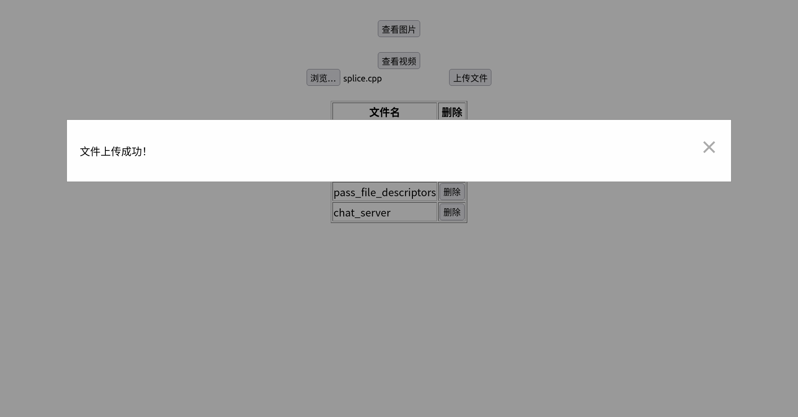

WebServer
===============
	
本项目基于Linux环境，使用C/C++开发了一个轻量级多线程HTTP服务器。服务器支持多客户端并发连接，提供图片、视频资源访问以及文件上传和删除功能。
主要工作：
◆ 利用Socket来实现客户端和服务器之间的通信；
◆ 利用epoll技术实现I/O多路复用，提高了效率和服务器处理高并发的能力；
◆ 对浏览器的GET和POST请求进行处理，使用有限状态机逻辑高效解析HTTP报文；
◆ 实现了线程池机制，通过多线程技术提供并行服务，提升了服务器的并发处理能力;
◆ 实现了基于双向升序链表的对非活跃连接的定时删除功能，优化了服务器的资源管理。

**效果展示**
> 查看图片

> 查看视频

> 文件上传和删除

